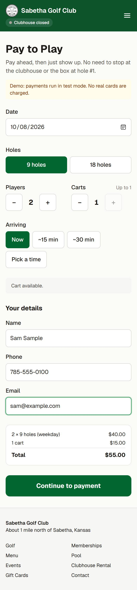
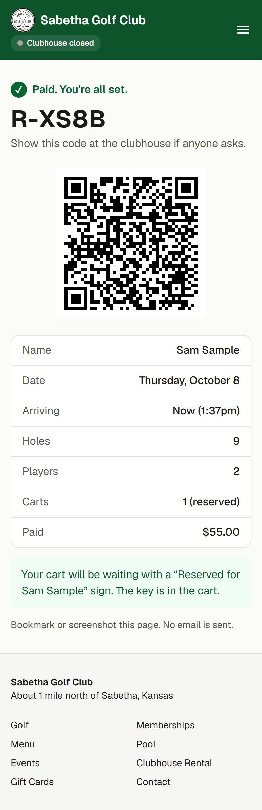
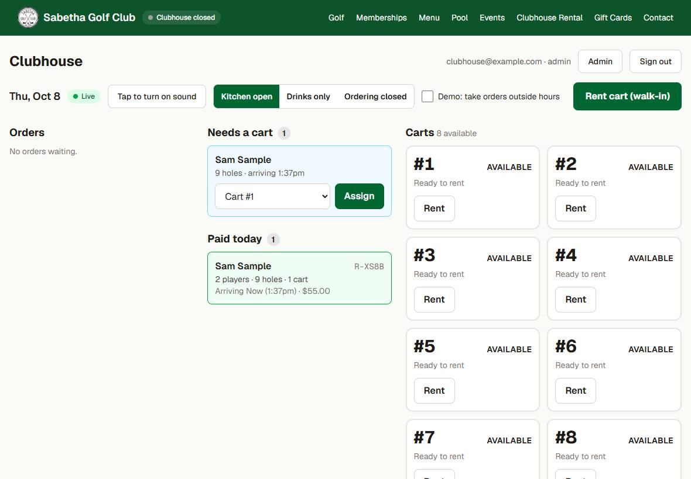
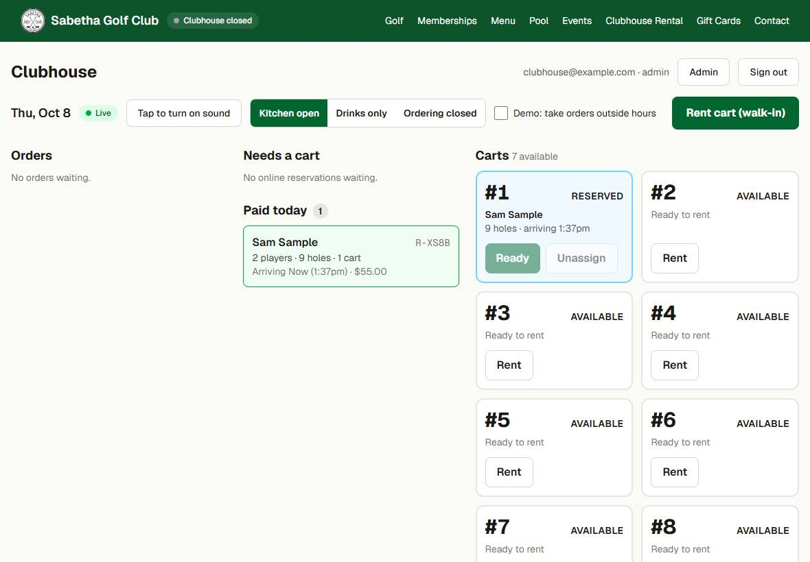
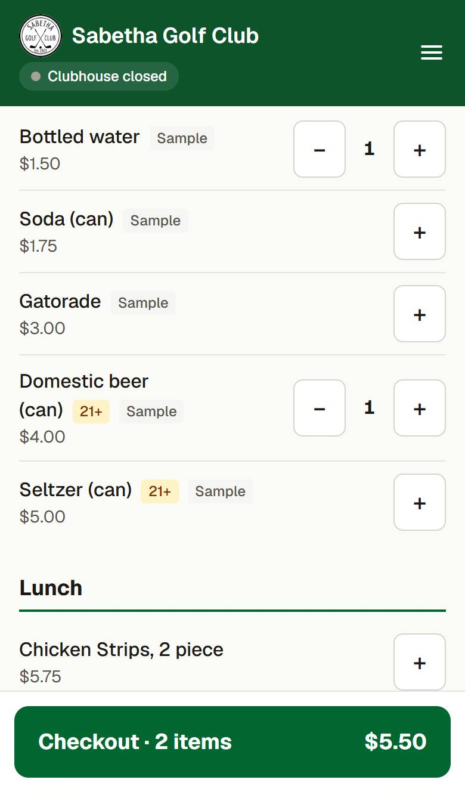
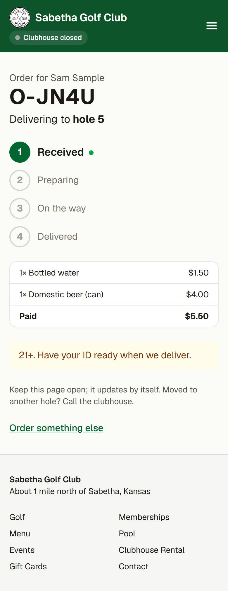
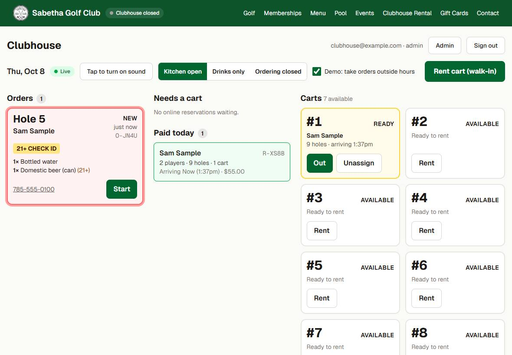
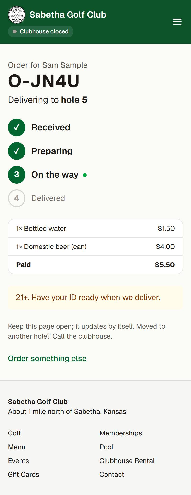
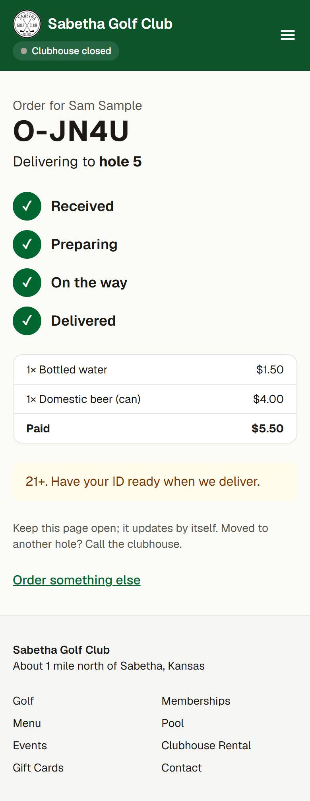

# Pitch demo: phone + tablet walkthrough

How to show the Sabetha Golf Club systems to the manager and board, with one phone (the golfer) and one tablet (the clubhouse counter). Every step below was run on the live site, https://sabetha-golf-course.vercel.app, on 2026-10-08 with `npm run e2e:demo` (script: `e2e/demo-walkthrough.cjs`). Screenshots in `docs/demo/` come from that run.

Everything is in **demo mode**: payments go to the Square **sandbox** (no real money), and prices, drinks, membership types and the cart count are **samples** until the club confirms them (PLAN.md section 7).

## Before the pitch

1. **Create your own logins** (there are none right now; test accounts are deleted after every run):
   - Supabase dashboard → Authentication → Users → **Add user** (email + password, auto-confirm). Make one for you, and optionally one for the counter tablet.
   - `npm run staff:role -- <your-email> admin` (admin can see the Demo switch and the Admin pages). Use `staff` for a counter-only login.
   - In Supabase → Authentication → Sign In / Providers, turn **off** "Allow new users to sign up".
2. **Tablet**: open `/staff`, sign in, tap **Tap to turn on sound** (tablets block audio until a tap), and check the **Live** dot is green.
3. **If the clubhouse is closed during the pitch** (it is Mon–Tue, and before 4:30pm Wed–Fri): tick **Demo: take orders outside hours** on the tablet. Without it, Order to the Course correctly says the clubhouse is closed. Untick it afterwards.
4. **Print the signs** (optional but it lands well): Admin → **QR signs** → print the hole #1 sign and the hole 5 tee sign. Have people scan them with their own phones.
5. Test card for every payment: **4111 1111 1111 1111**, any future date (e.g. 12/30), CVV **111**, ZIP 66534.

## The walkthrough (about 5 minutes)

Lead with the two problems they already feel: **the honor box at hole #1** and **the paper cart sheet**.

### 1. Pay to Play replaces the honor box

On the phone, scan the hole #1 sign (or tap **Pay to Play** on the home page). Pick 2 players, 1 cart, arriving **Now**, enter a name, phone and email.

- The price is worked out live from the club's rates (weekday/weekend, 9/18 holes, carts): 2 × 9 holes weekday $40 + 1 cart $15 = **$55.00**.
- It checks a cart is free before taking money.

| Pay form                                                   | Receipt                                                |
| ---------------------------------------------------------- | ------------------------------------------------------ |
|  |  |

Pay with the test card. The **receipt is the confirmation**: a short code, a QR, and "your cart will be waiting with a Reserved for … sign". No email is sent, and nobody has to find an envelope or cash.

### 2. It shows up on the tablet by itself

Point at the tablet: the round appears under **Paid today** and **Needs a cart** within about a second, with a chime. Nobody refreshed anything. (Measured: 0.5–0.9 s after the receipt.)

### 3. The cart board replaces the paper sheet

Tap **Assign** (it suggests a free cart), put the key and the "Reserved for Sam" sign in the cart, tap **Ready**. Later, **Out** when they drive off and **Returned** when it comes back.

- Walk-ins still pay at the counter as today; **Rent cart (walk-in)** just logs which cart went out. That is the paper sheet, done.
- Carts in use can't be double-booked online, and Pay to Play only offers what is actually free.

### 4. Order to the Course from hole 5

On the phone, scan the hole 5 tee sign (`/order?hole=5`, so the hole is already picked). Add a beer and a water, check out with the test card.

| Menu                                                   | Order status                                        |
| ------------------------------------------------------ | --------------------------------------------------- |
|  |  |

The tablet shows the order straight away (0.1 s), marked **Hole 5** and **21+ CHECK ID** because there's a beer in it.

### 5. Walk it through to Delivered

On the tablet tap **Start** → **Send out** → **Delivered**. The golfer's phone follows along: Received → Preparing → On the way → Delivered. The phone checks every 5 seconds, so allow a moment (measured 5.2–5.4 s per step).

| On the way                                         | Delivered                                        |
| -------------------------------------------------- | ------------------------------------------------ |
|  |  |

If the kitchen is closing for an event, tap **Drinks only** or **Ordering closed** on the tablet; anyone opening the order page sees the change straight away. It goes back to the admin's default the next morning.

### 6. If they ask: what else is there

- **Memberships**: apply online (lands in Admin → Members for the Club Secretary) and pay dues in full or in halves (March 1 / June 1).
- **Admin** (`/admin`): change green fees, cart prices, clubhouse hours, the menu, membership types and carts. Changes show on the website immediately. **Export** downloads CSVs of rounds, orders and dues to match against Square.
- **QR signs**: hole #1, all nine tee boxes, cart stickers.
- The public site: hours with an Open/Closed badge, rates, the menu as real text (it was a photo), pool, events, clubhouse rental, contact.

## What the run checked

From `npm run e2e:demo -- https://sabetha-golf-course.vercel.app` (three clean runs):

| Step                                                      | Result                      |
| --------------------------------------------------------- | --------------------------- |
| Tablet signs in, board Live                               | ✅                          |
| Phone pays for 2 players + 1 cart ($55.00, sandbox)       | ✅ receipt code shown       |
| Round appears on tablet without refresh                   | ✅ 0.5–0.9 s                |
| Assign cart, tap Ready                                    | ✅                          |
| Drink order from hole 5 (sandbox)                         | ✅                          |
| Order appears on tablet                                   | ✅ 0.1 s, with 21+ badge    |
| Start / Send out → phone updates                          | ✅ about 5 s each (polling) |
| Delivered → leaves the queue, phone shows Delivered       | ✅                          |
| 13 public pages on a phone: no sideways scrolling         | ✅                          |
| 8 staff/admin screens on a tablet, landscape and portrait | ✅                          |
| Page errors                                               | none                        |

The script deletes its test round, order and login afterwards and puts the demo switch and kitchen status back.

## Things to say plainly

- **Demo, not live**: sandbox payments, sample prices and drinks, 8 sample carts. Going live (PLAN.md Phase 4) needs the club's own Square account, real prices, menu, membership tiers and cart count, staff logins, and the domain pointed here.
- **No accounts for golfers** and **no tee times**, on purpose: it stays a show-up-and-play club.
- **No emails or texts** are sent; confirmations are on-screen.
- Questions to bring (PLAN.md section 7): is the counter POS Square; membership prices and whether the board approves; how many rental carts; refund / no-show policy; who watches the tablet and delivers; kitchen vs clubhouse hours; do members pay green fees; is a ~3% card fee OK.
